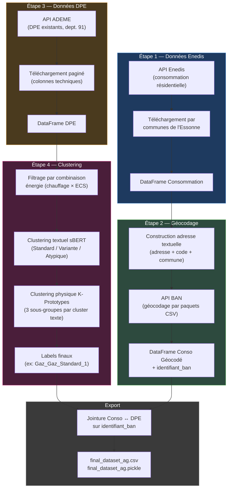

# Fonctionnement de la Pipeline DPE / Enedis

## Vue d'ensemble

La pipeline automatise l'ensemble du processus de collecte, nettoyage et classification des logements du département de l'Essonne (91). Elle enchaîne **4 étapes principales** : la récupération des données de consommation énergétique (Enedis), le géocodage des adresses, la récupération des diagnostics de performance énergétique (DPE), puis un clustering en deux niveaux pour regrouper les logements similaires.

---

## Schéma de la pipeline



---

## Exécution de la pipeline

L'intégralité du traitement a été regroupée dans un point d'entrée unique. 

Pour lancer la pipeline complète, exécutez simplement :
```bash
python main.py
```

**Système de mise en cache intelligent** : Le script vérifie la présence des données sauvegardées temporairement en local sous forme de fichiers extenion `.pickle` (`conso_91_2024_geocoded.pickle` et `dpe_91_v2.pickle`). S'ils sont trouvés, les téléchargements API de masse massifs sont intelligemment ignorés pour se concentrer sur l'exécution des algorithmes directement sur la donnée fraîche.

---

## Description détaillée des étapes

### Étape 1 — Téléchargement des données Enedis

- **Source** : API open data Enedis (consommation résidentielle annuelle par adresse)
- **Périmètre** : Toutes les communes de l'Essonne (91), listées dans `List_Communes_91.xlsx`
- **Année** : Année en cours − 2 (calculée dynamiquement)
- **Méthode** : La liste des communes est scindée en 2 lots pour respecter les limites de l'API, puis les résultats sont concaténés
- **Cache** : Si le fichier `conso_91_2024_geocoded.pickle` existe déjà, cette étape est sautée

### Étape 2 — Géocodage des adresses

- **But** : Associer un *identifiant BAN* (Base Adresse Nationale) unique à chaque adresse de consommation
- **Méthode** : Construction d'une adresse textuelle complète, envoyée par paquets de 100 à l'API BAN (`api-adresse.data.gouv.fr/search/csv/`)
- **Contrôle qualité** : Si plus de 90 % des adresses obtiennent un identifiant BAN unique, les doublons sont supprimés (en gardant le meilleur score de géocodage)
- **Résultat** : DataFrame enrichi avec `identifiant_ban`, `latitude`, `longitude`, `result_score`

### Étape 3 — Téléchargement des DPE

- **Source** : API data ADEME (diagnostics de performance énergétique existants)
- **Périmètre** : Département 91
- **Colonnes récupérées** : La requête API est optimisée par la sélection stricte et codée en dur de **29 variables techniques** clés (chauffage, ECS, isolation, etc.). Ceci accélère drastiquement le téléchargement ADEME et rend le code robuste en le forçant à être indépendant d'anciens dictionnaires de références XLSX.
- **Cache** : Si le fichier `dpe_91_v2.pickle` existe déjà, cette étape est sautée

### Étape 4 — Clustering en deux niveaux

Le clustering s'effectue séparément pour **3 combinaisons d'énergie** :

| Chauffage | ECS |
|---|---|
| Gaz naturel | Gaz naturel |
| Électricité | Électricité |
| Réseau de Chauffage urbain | Réseau de Chauffage urbain |

#### Niveau 1 — Clustering textuel (sBERT + Jenks)

1. **Logement de référence** : Pour chaque combinaison, on identifie la modalité la plus fréquente de chaque variable textuelle (descriptions des installations)
2. **Embeddings** : Le texte de référence et celui de chaque logement sont encodés via le modèle *paraphrase-multilingual-MiniLM-L12-v2*
3. **Similarité cosinus** : Chaque logement reçoit un score de similarité par rapport au logement de référence
4. **Classification Jenks** (3 classes) : Les logements sont répartis en **Standard** (très similaires), **Variante** (intermédiaires), **Atypique** (très différents)

#### Niveau 2 — Clustering physique (K-Prototypes)

Pour chaque cluster textuel :
1. **Prétraitement** : Variables ordinales mappées numériquement (période de construction, qualité d'isolation), variables quantitatives normalisées (Yeo-Johnson + MinMaxScaler)
2. **K-Prototypes** (k=3) : Algorithme capable de gérer simultanément des variables catégorielles et numériques
3. **Résultat** : 3 sous-groupes physiques par cluster textuel → label final de type `Gaz_Gaz_Standard_1`

### Export

- **Jointure** : Les données DPE clusterisées sont jointes aux données de consommation Enedis via l'`identifiant_ban`
- **Fichiers produits** : `final_dataset_ag.csv` et `final_dataset_ag.pickle`
